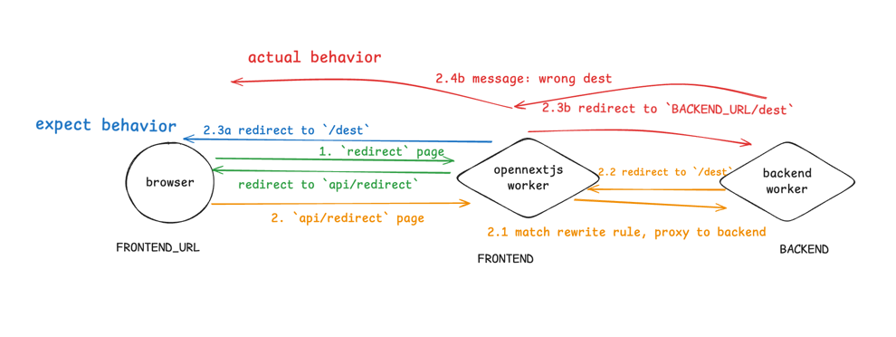
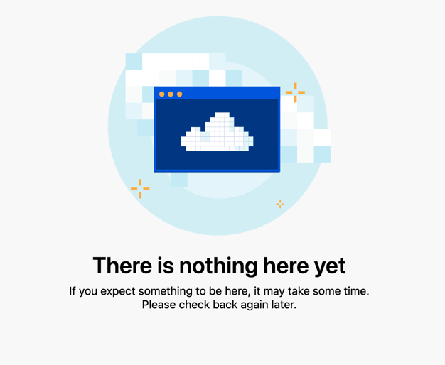

## opennext/cloudflare rewrite and redirect issue
this is a demo repo to reproduction rewrite/redirect issue in `opennext/cloudflare`

there are two part in this repo, frontend and backend.


### Issue 1
<details open>
<summary> Detail </summary>

`rewrites` can't handle redirect from third-party endpoint as expect.

- [Live Demo](https://next-rewrite-redirect-demo-frontend.ktlab.io) opennextjs in cf worker redirect to wrong destination
- [Live Demo](https://next-rewrite-redirect-demo.vercel.app) in vercel work as expect



### behavior
1. browser: request `redirect` page
2. nextjs server: return redirect(`/api/redirect`)
3. browser: request `/api/redirect` page 
4. nextjs server: match rewrite rule, proxy to backend
5. backend: return redirect to `/dest`

**expect** (vercel)
6. nextjs server: return (redirect to `/dest`) from backend
7. browser: request `/dest` page

**actual**
6. opennextjs server: request `/dest` to backend
7. backend: return `message: wrong destination`
8. opennextjs server: return `message: wrong destination` to browser

#### backend
a plain worker that expose 2 route.

[](https://deploy.workers.cloudflare.com/?url=https%3A%2F%2Fgithub.com%2FktKongTong%2Fnext-rewrite-redirect-demo%2Ftree%2Fmain%2Fbackend)

```ts
// redirect to `/dest`
app.get('/api/redirect', async (c) => {
  setCookie(c, 'example', 'token', {})
  return c.redirect('/dest')
})

app.get('/dest', (c) => c.json({ message: "Oops, you are redirected to the wrong page."}))

```
**in cloudflare**

[](https://deploy.workers.cloudflare.com/?url=https%3A%2F%2Fgithub.com%2FktKongTong%2Fnext-rewrite-redirect-demo%2Ftree%2Fmain%2Ffrontend)

**in vercel**

[](https://vercel.com/new/clone?repository-url=https%3A%2F%2Fgithub.com%2Fvercel%2Fnext.js%2Ftree%2Fcanary%2Fexamples%2Fhello-world)

### frontend
```tsx
// next.config.ts
const nextConfig = {
  async rewrites() {
    return [
      {
        source: '/api/:path*',
        destination: `${BACKEND_URL}/api/:path*`,
      },
    ]
  }
}

// home page
import {useRouter} from "next/navigation";
export default function Home() {
  const router = useRouter();
  return <button onClick={() => {router.push('/redirect')}}>click to redirect</button>
}

// `redirect` page
import {redirect} from "next/navigation";
export default function Redirect() {
  return redirect('/api/redirect')
}

// `dest` page
export default function Dest() {
  return <div>Destination</div>
}
```

</details>


## Issue 2

`rewrites` can't work when using `*.worker.dev` domain that auto assigned by cloudflare.

- [live demo using custom domain](https://next-rewrite-redirect-demo-frontend.ktlab.io/api/redirect), proxy and pass request to backend
- [live demo using worker.dev](https://next-rewrite-redirect-demo.kt-f63.workers.dev/redirect), return 404 from cloudflare

still use the example above.

1. request to `${FRONTEND_URL}/api/redirect`.

**expect**
2. proxy and pass request to backend.

**actual**
2. return 404 content from cloudflare directly.



